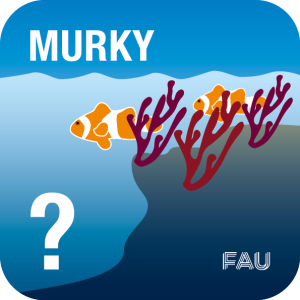
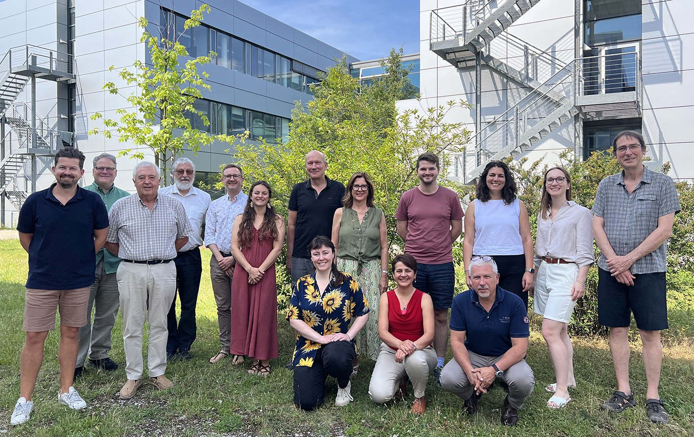

# Mesophotic and turbid reefs as key ecosystems for the future (MURKY)

Welcome to the GitHub organisation page of MURKY. Recent palaeontological studies have revealed that mesophotic reefs might have been more common throughout the evolutionary history of reefs than previously considered. This project aims to evaluate whether the current success of marginal coral ecosystems is related to their long-term geological resilience throughout the Phanerozoic.

This project is led by [Nadia Santodomingo](mailto:n.santodomingo@nhm.ac.uk), Natural History Museum and [Lewis A. Jones](mailto:lewis.jones@ucl.ac.uk), University College London.

# Team

- [Markus Aretz](mailto:markus.aretz@get.omp.eu), Université de Toulouse, France
- [Francesca Bosellini](mailto:francesca.bosellini@unimore.it), Università di Modena e Reggio Emilia, Italy
- [Juan C. Braga](mailto:jbraga@ugr.es), University of Granada, Spain
- [Clara Diaz](mailto:clara.diaz@plymouth.ac.uk), University of Plymouth, UK
- [Danijela Dimitrijevic](mailto:danijela.dimitrijevic@fau.de), FAU Erlangen, Germany
- [Elizabeth Dowding](mailto:elizabeth.dowding@fau.de), FAU Erlangen, Germany
- [Ken Johnson](mailto:k.johnson@nhm.ac.uk), Natural History Museum, UK
- [Lewis A. Jones](mailto:lewis.jones@ucl.ac.uk), University College London, UK
- [Wolfgang Kiessling](mailto:wolfgang.kiessling@fau.de), FAU Erlangen, Germany
- [Bernard Lathuilière](mailto:bernard.lathuiliere@univ-lorraine.fr), University of Lorraine, France
- [Kyle Morgan](mailto:kmorgan@ntu.edu.sg), Nanyang Technological University, Singapore
- [Michele Morsilli](mailto:mrh@unife.it), Università di Ferrara, Italy
- [John Pandolfi](mailto:j.pandolfi@uq.edu.au), University of Queensland, Australia
- [Nadia Santodomingo](mailto:n.santodomingo@nhm.ac.uk), Natural History Museum, UK
- [Barbara Seuss](mailto:pal-synthesis@fau.de), FAU Erlangen, Germany
- [Mikołaj Zapalski](mailto:m.zapalski@uw.edu.pl), University of Warsaw, Poland

> **Back row, from the left:** Kyle Morgan, Ken Johnson, Juan Carlos Braga, Bernard Lathuilière, Mikołaj Zapalski, Clara Diaz, Wolfgang Kiessling, Francesca Bosellini, Lewis Jones, Danijela Dimitrijević, Patrycia Dvorzcak, and John Pandolfi  
> **Front row, from the left:** Elizabeth Dowding, Nadia Santodomingo, and Michele Morsilli

## Links

- Zenodo data repository (coming soon)

## Funding Information

The MURKY project team was assembled through a [Paleosynthesis](https://www.paleosynthesis.nat.fau.de/index.php/murky/) funded research workshop.

The MURKY project itself is currently unfunded. 
